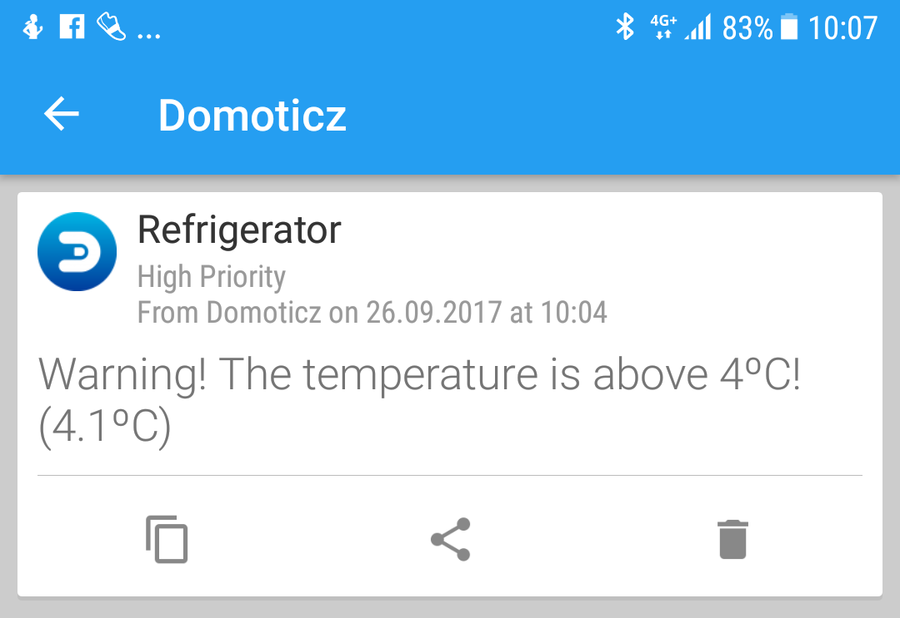

# Notification when temperature deviates from set values
A LUA script to send a Notification if a temperature exceeds set upper and lower limits.

This is a good way to get warned if the freezer or the refrigerator is too hot or cold.

**Functionality**
- Send a notification if temperature exceeds upper set temperature
- Send a notification if temperature drops below lower set temperature
- Configurable Notification title, message, and priority Level for both upper and lower notification.
- Only one notification will be sent until the temperature is back to normal. This is what the uservariable is used for.
- Temperature value can be both "+" and "-" as well as decimal numbers divided by dot-symbol.

**How to use**
- Create a new String UserVariable in Domoticz under /#/UserVariables
- Paste the script into Domoticz event editor and Configure the setting in top of the script.
- The script is designed for devices that output sValues in this format: "0.00". If your device is using a difrent format you may need to edit line 8.
```lua
local temp = tonumber(otherdevices_svalues[temp_device]) -- Sensor data to number
```
- I recommend to run the scipt on "time".


Example in Pushover:

 

